# Base de Datos de Bienes Tecnológicos.
En orgranizaciones pequeñas, medianas y grandes cuentan con equipos de cómputo, routers, switches, pbx, rack, puntos de acceso inalámbricos, teléfonos IP/analógicos, impresoras, monitores, sotware, etc. Algunos de los equipos anteriormente mencionados son utilizados por el personal y otros son utilizados para intercomunicación con el servidor y los equipos de cómputo. Por lo que, el administador debe de controlar y adminstrar para evitar problemas de localización física, ip duplicadas, software instalados, segmento de red, soporte técnico a usuarios, servidores instalados, impresoras y equipos de telecomunicación.

iTop es un sistema de base de datos de configuración de bienes tecnológicos (CMDB, por sus siglas en ingles), el cual permite tener identificado y relacionado todos los componentes de TI que tenga la organización. La instalación de iTop en CentOS 7 se presenta a continuación.

## Preparación del Servidor.
Los requerimientos mínimos en un servidor es tener la instalación básica de CentOS esto es para evitar tener otras aplicaciones que no son necesarias para iTop, ya que pueden disminuir los recursos de hardware del equipo. Los pasos para la preparación son:

### Limpieza de metadatos.
Para limpiar los metadatos que se hayan generado en la instalación o de aplicaciones nuevas, se debe de ejecutar el siguiente comando.
>\# yum clean metadata

### Actualización del sistema.
Actualizar el sistema con las últimas versiones de programas instalados en CentOS.
>\# yum -y update

### Repositorio EPEL.
Son paquetes adicionales para Linux empresarial y es creado, mantenido y administrado por el grupo de interés especial de Fedora.
>\# yum -y install epel-release

### Repositorio Remi.
Es un repositorio que contiene paquetes actualizados para sistemas Linux Enterprise.
>\# rpm -Uvh http://rpms.famillecollect.com/enterprise/remi-release-7.rpm

### Herramientas del sistema.
Instalar comandos para configurar la red, descargar archivos, modificar políticas de SELinux, entre otras.
>\# yum -y install net-tools policycoreutils-python wget vim bash-completion unzip graphviz

### Instalación de apache.
Apache con los módulos de seguridad de ssh, autenticación por kerberos y seguridad.
>\# yum -y install httpd mod_security mod_ssl mod_auth_kerb

### Instalación de mariaDB.
MariaDB servidor y cliente.
>\# yum -y install mariadb mariadb-server

### Instalación de PHP.
PHP 7.0 con las extensiones de xml, ldap, gd, soap, mbstring y mcrypt
>\# yum --enablerepo=remi,remi-php70 -y install php php-zip php-mysql php-xml php-xmlrpc php-ldap php-gd php-soap php-intl php-mbstring php-mcrypt

## iTop.
### Descarga e instalación de iTop.
Instalación de iTop 2.5.0 en CentOS 7.
>\# wget http://downloads.sourceforge.net/project/itop/itop/2.5.0/iTop-2.5.0-3935.zip
>
>\# cd ~/
>
>\# mkdir /var/www/html/itop
>
>\# unzip iTop-2.5.0-3935.zip
>
>\# mv web /var/www/html/itop/
>
>\# mkdir /var/www/html/itop/web/{conf,env,env-production,env-production-build}

### Descarga e instalación de TeemIP.
Extensión que permitirá crear, modificar y administrar IP's.
>\# cd ~/
>
>\# wget https://downloads.sourceforge.net/project/teemip/teemip%20-%20an%20iTop%20module/2.3.0/teemip-core-ip-mgmt-2.3.0.zip
>
>\# unzip teemip-core-ip-mgmt-2.3.0.zip
>
>\# mv teemip-core-ip-mgmt /var/www/html/itop/web/extensions/

## Seguridad y SELinux.
### Propietario y permisos.
Se van a asignar propietario, grupo y permisos sobre la carpeta y subcarpetas de iTop.
>\# chown -R apache:apache /var/www/html/itop
>
>\# find /var/www/html/itop -type d -exec chmod 755 {}\;
>
>\# find /var/www/html/itop -type f -exec chmod 644 {}\;

### Firewall.
>\# firewall-cmd --zone=public --add-service=http --permanent
>
>\# firewall-cmd --reload

### Cron iTop.
>\# mkdir /etc/itop
>
>\# mv /var/www/html/itop/web/webservices/cron.distrib /etc/itop/
>
>\# sed -i "s/auth_user=admin/auth_user=ADMINISTRADOR/g" /etc/itop/cron.distrib
>
>\# sed -i "s/auth_pwd=admin/auth_admin=PASSWORD/g" /etc/itop/cron.distrib
>
Donde ADMINISTRADOR es nombre del usuario administrador y PASSWORD es la contraseña asignada por el usuario.
>
>\# echo '*/5 * * * * /bin/php /var/www/html/itop/web/webservices/cron.php --param_file=/etc/itop/cron.distrib >> /var/log/itop-cron.log 2>&1' | crontab
>
>\# echo '*/5 * * * * root /usr/bin/php /var/www/html/itop/web/webservices/cron.php --param_file=/etc/itop/cron.distrib >> /var/log/itop-cron.log 2>&1' | crontab

### SELinux.
>\# setsebool -P httpd_can_network_connect_db_on
>
>\# setsebool -P httpd_can_connect_ldap_on
>
>\# chcon -R -u system_u /var/www/html/*
>\# chcon -R -t httpd_sys_content_t /var/www/html/itop
>
>\# semanage fcontext -a -t etc_t '/etc/itop/cron.distrib'
>
>\# semanage fcontext -a -t httpd_sys_content_t "/var/www/html/itop(/.*)?"
>
>\# semanage fcontext -a -t httpd_sys_rw_content_t '/var/www/html/itop/web/conf'
>
>\# semanage fcontext -a -t httpd_sys_rw_content_t '/var/www/html/itop/web/data'
>
>\# semanage fcontext -a -t httpd_sys_rw_content_t '/var/www/html/itop/web/env-production'
>
>\# semanage fcontext -a -t httpd_sys_rw_content_t '/var/www/html/itop/web/env-production-build'
>
>\# semanage fcontext -a -t httpd_sys_rw_content_t '/var/www/html/itop/web/log'
>
>\# semanage fcontext -a -t httpd_sys_rw_content_t '/var/www/html/itop/web/extensions'
>
>\# restorecon -R -v '/var/www/html/itop'
>
>\# restorecon -v '/var/www/html/itop/web/conf'
>
>\# restorecon -v '/var/www/html/itop/web/data'
>
>\# restorecon -v '/var/www/html/itop/web/env-production'
>
>\# restorecon -v '/var/www/html/itop/web/env-production-build'
>
>\# restorecon -v '/var/www/html/itop/web/log'
>
>\# restorecon -v '/var/www/html/itop/web/extensions'

## Configuraciones en PHP y MariaDB.
### PHP.ini
Modificar parámetros de tamaños de archivos, máximo tiempo de entrada y post
>\# sed -i "s/post_max_size=8M/post_max_size=32M/g" /etc/php.ini
>
>\# sed -i "s/upload_max_filesize=2M/upload_max_filesize=30M/g" /etc/php.ini
>
>\# sed -i "s/max_input_time=60/max_input_time=180/g" /etc/php.ini

## MariaDB
Se define el máximo de paquetes permitidos a la conexión de la base de datos.
>\# sed -i "s/\[mysqld_safe\]/max_allowed_packet=33M\n\n\n\[mysqld_safe\]/g" /etc/my.cnf

## Apache
### DocumentRoot
Se modifica la carpeta en donde se aloja la página de iTop para acceder directamente por la IP.
>\# sed -i "s/DocumentRoot \"\/var\/www\/html\"/DocumentRoot \"\/var\/www\/html\/itop\/web\"/g" /etc/httpd/conf/httpd.conf

## Activación de Servicios.
### Apache
>\# systemctl enable httpd.service
>
>\# systemctl start httpd.service

### MariaDB
>\# systemctl enable mariadb.service
>
>\# systemctl start mariadb.service

Creación de la base de datos para iTop.
>\# mysql_secure_instalation
>
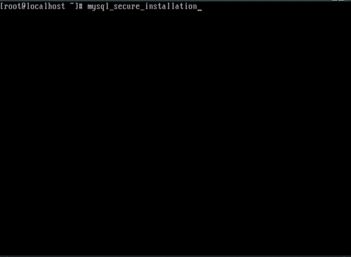
>
>\# mysql -u root -pPASSWORD -e "CREATE DATABASE itopdb DEFAULT CHARACTER SET utf8 COLLATE utf8_unicode_ci"
>
>\# mysql -u root -pPASSWROD -e "GRANT ALL ON itopdb.* TO 'usritop'@'localhost' IDENTIFIED BY 'PASSWORDITOP';"
>
>\# mysql -u root -pPASSWORD -e "FLUSH PRIVILEGES;"

Donde PASSWORD es la contraseña del usuario root de MariaDB y PASSWORDITOP es la contraseña del usuario usritop para la base de datos.

## Configuración de iTop.
### Paso 1.
Una vez realizado los pasos anteriores se debe de acceder a la página a través de la dirección IP y debe de mostrar los prerequisitos validados por iTop.
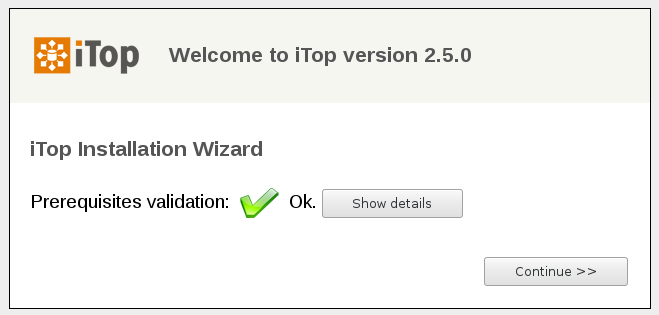

Para ver los detalles de los requisitos validados, se da click en el botón _show details_
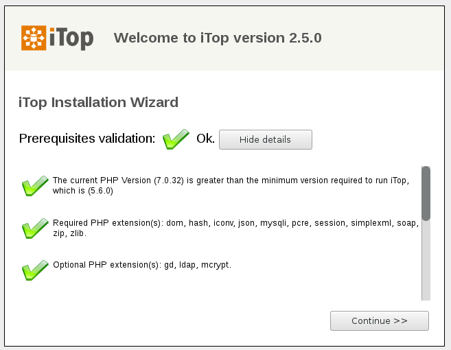

### Paso 2.
Una vez validado que están correctos los requisitos se da click en _Continue_. En la siguiente página se debe de seleccionar la opción _Install a new iTop_ por no ser una actualización. Se procede a continuar.
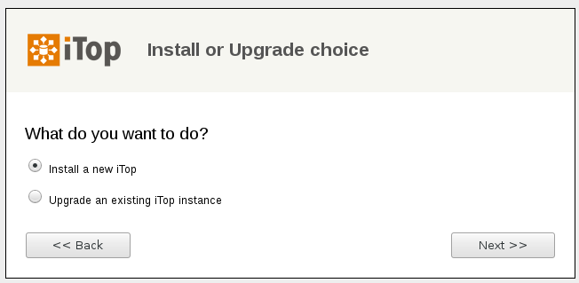

### Paso 3.
Se habilita la casilla de aceptación de la licencia y se continua con el proceso de la instalación.
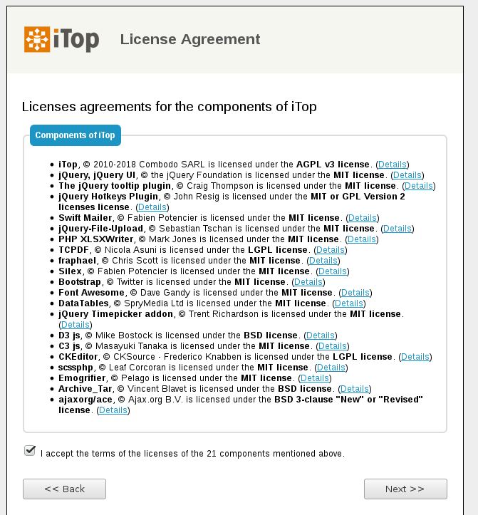

### Paso 4.
Se ingresa los datos para la conexión de la base de datos y su prefixo. El usuario y contraseña son del usuario usritop para la base de datos itopdb.

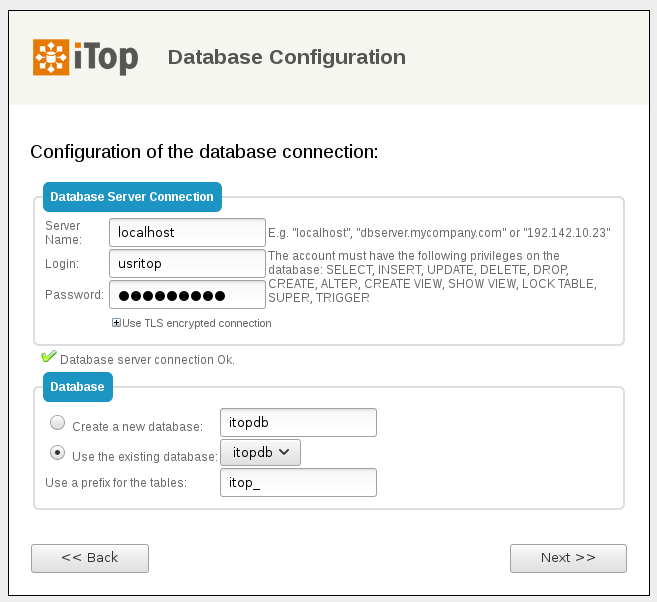

### Paso 5.
Se asigne la contraseña del administrador.
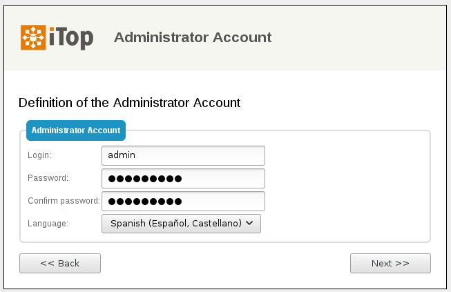

### Paso 6.
Se puede cambiar el idioma y se debe de seleccinoar la opción de _I am installing a producction instance, create an empty database to start from.

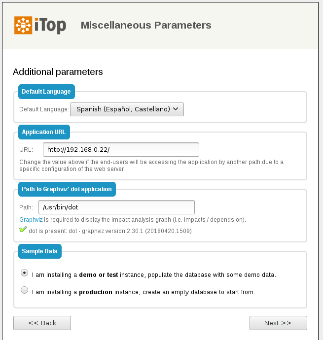

### Paso 7.
Se dejan habilitados las opciones de administración o se deshabilitan según sea el caso.
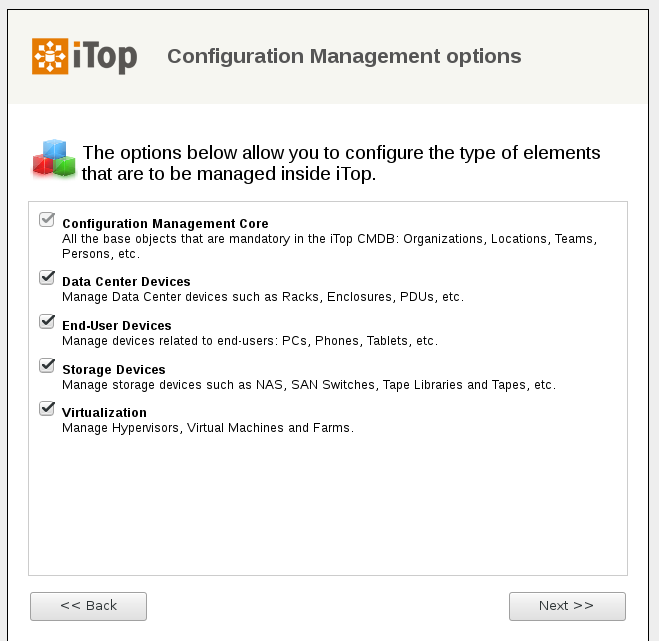

### Paso 8.
Seleccionar entre el servicio e la infraestructura de red en el entorno de IT.
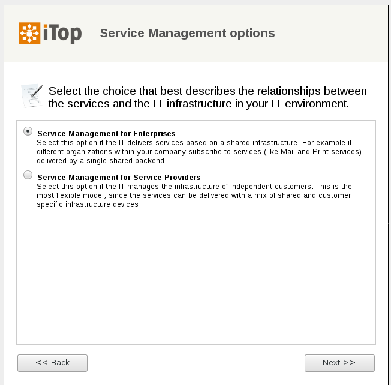

### Paso 9.
Selección del tipo de ticket que puede ser sencillo o basado en ITIL.

### Paso 10.
Selección del tipo de administración que puede ser simple o basado en ITIL.
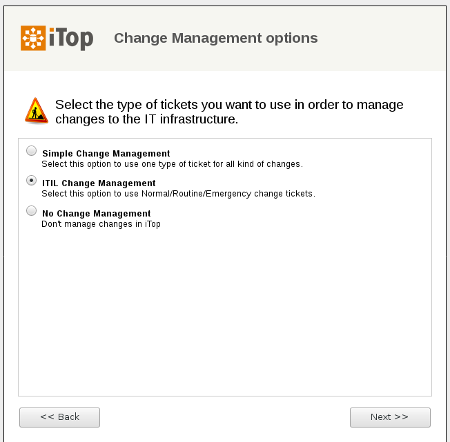

### Paso 11.
Selección de tickets ITIL.

### Paso 12.
Habilitar la extensión de IPAM ofr iTop(TeemIP).
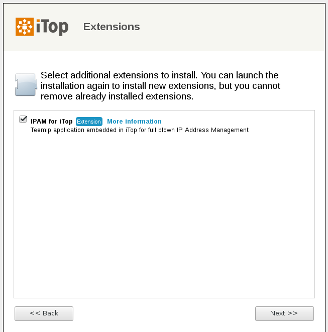

### Paso 13.
Listo para realizar la instalación.

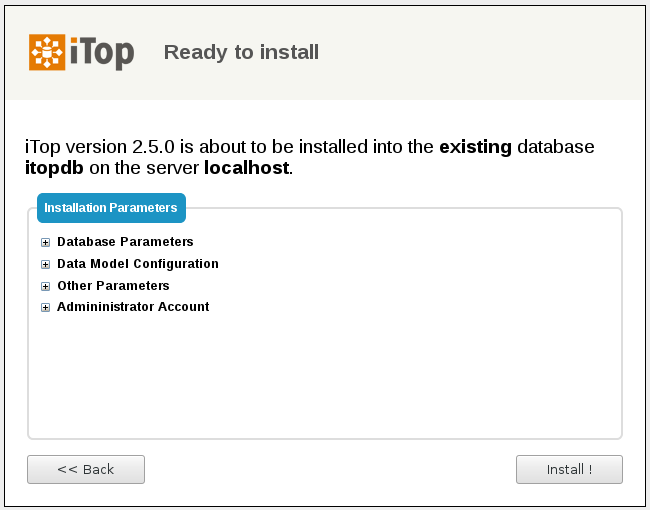

Proceso de instalación.

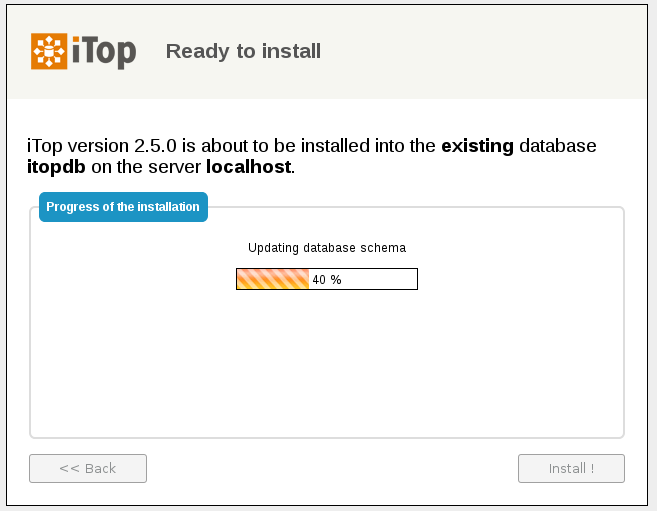

### Paso 14.
Instalación satisfactoria.

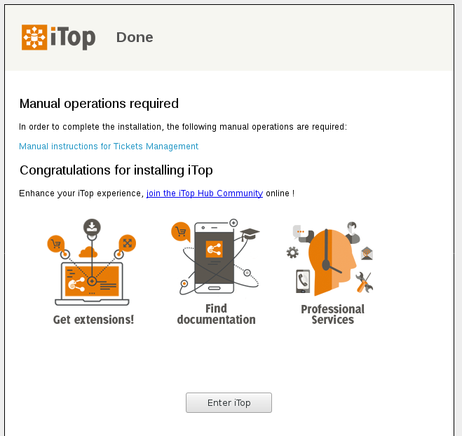

### Página de bienvenida.
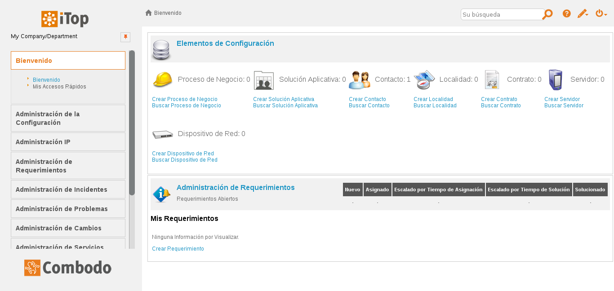
